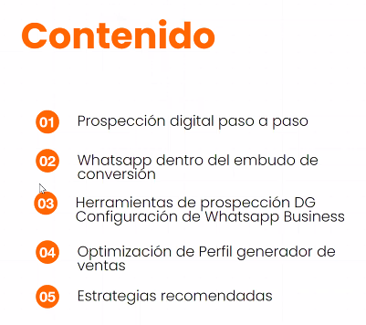
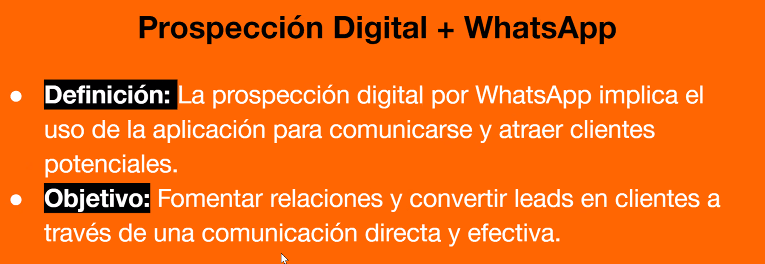
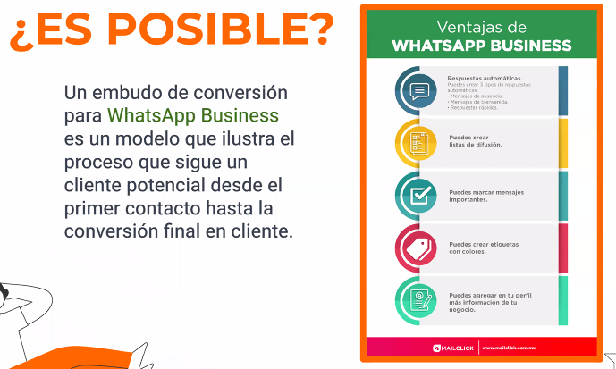
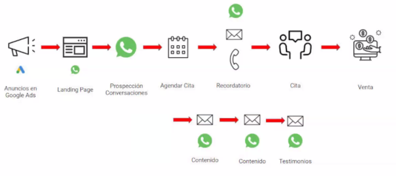
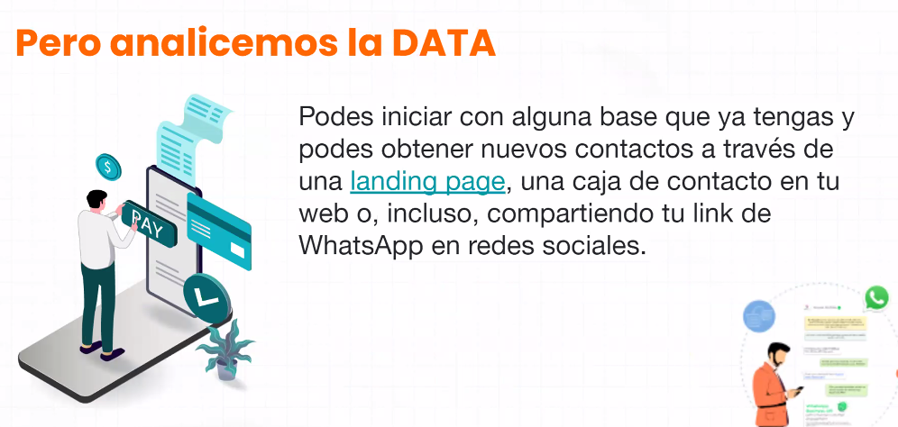
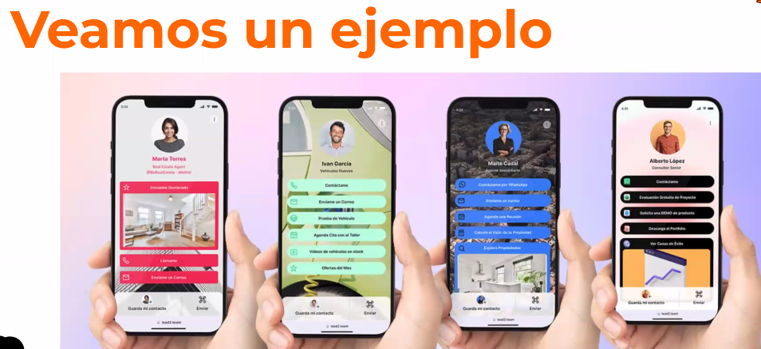

# Como usar whatsapp para atraer nuevos clientes

Instructora: Giselle Gioffre

1. me escribe
2. yo escribo

- me tengo que vender, decir quien soy y en que le puedo ser útil, y despierta ansiedad en el cliente
- como vendo lo intangible?

- respuestas rápidas
- listas de difusión
- documentación, respuestas

- evitar preguntas negativas, ya que se abre la amistad y se deja de ser concreto y directo, 
- no es necesario empatizar
- 

- cada uno tiene un rol
- cada uno tiene un aterrizaje diferente
- indican diferentes formas de contactar

- prospectar en whatsapp

propectar en:

1. linkedin
2. linktr.ee

**leer metodo AIDA para prospectar**